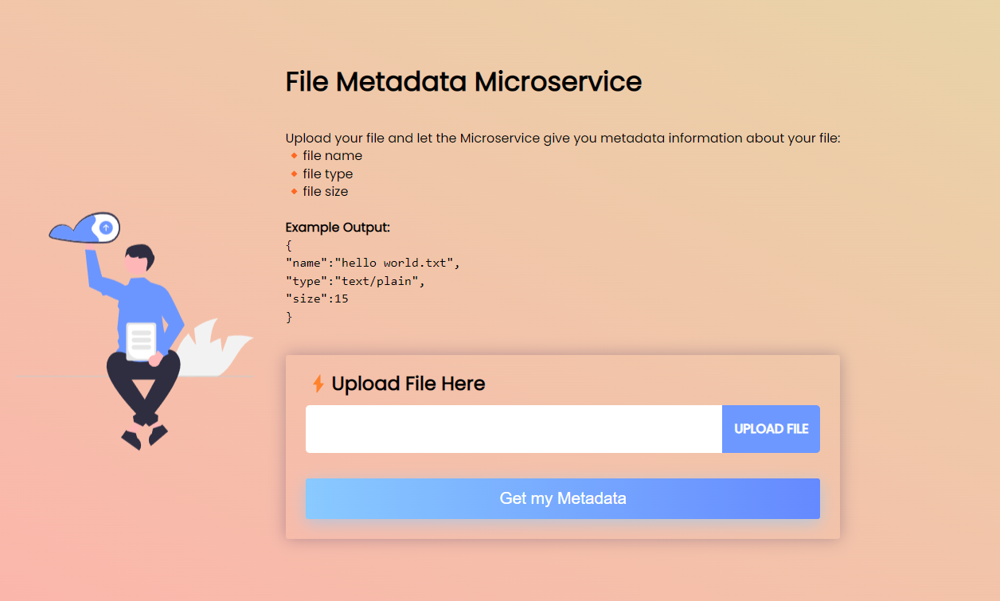

### File Metadata Microservice - A Backend Project
In software development Micro-services are simply an organisational approach where an applications is made up of small independent services that communicate over well-defined APIs.
 
 They are also known as Microservice Architecture. The biggest advantage is that they are loosely coupled so if something is broken we can easily pinpoint faults and fix things, but also if we make small changes it won't end up breaking the entire app.

 File Metadata Microservice allows you to upload your file and return metadata information about your file such as file name, file type, file size, etc., and can be configured to return more file type details. 


<br>


### Boilerplate
```
Boilerplate code used from FreeCodeCamp at: 
https://github.com/freeCodeCamp/boilerplate-project-filemetadata/

```


<br>

### Dependencies
```
cors
express
nodemon
dotenv
multer

```

<br>

### Getting Started
```
npm i cors express nodemon dotenv multer
npm start 

```

<br>

### Inside package.json...
```
  "scripts": {
    "start": "nodemon index.js"
```

<br>

### Demo
https://file-metadata-finder.zeenux0.repl.co




